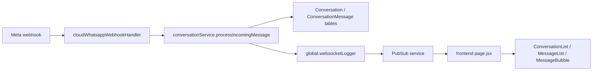
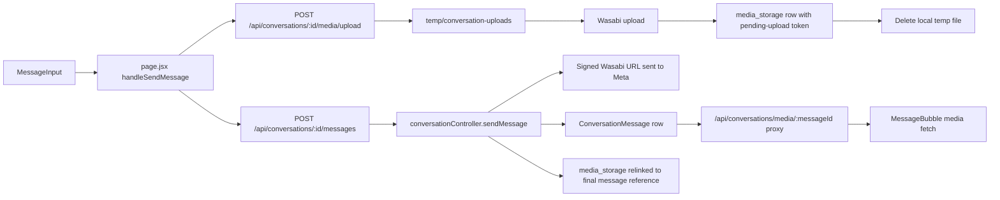

# Chat Module Implementation Guide

Last updated: 2026-03-07

## Purpose

This document describes the current chat implementation used in the dashboard application so a future team can rebuild or extract it into a dedicated `chat.` subdomain with full context.

It covers:

- The complete frontend file structure under `frontend/app/(dashboard)/dashboard/customer/cloud-api/chat`
- The active runtime path vs legacy/unused frontend files
- The backend conversation routes, controllers, services, and models
- How incoming and outgoing messages are stored, normalized, and rendered
- How media is handled across Wasabi, local disk, and the frontend media proxy
- Current implementation gaps that should be addressed during migration

## Scope and High-Level Architecture

Current runtime entry points:

- Frontend page: `frontend/app/(dashboard)/dashboard/customer/cloud-api/chat/page.jsx`
- Backend API mount: `backend/server.js` -> `/api/conversations`
- Backend route file: `backend/routes/conversationRoutes.js`

Storage layers involved:

- Main database:
  - `cloud_api_setup`
  - `cloud_api_reports`
- Conversations database:
  - `conversations`
  - `conversation_messages`
  - `media_storage`
- Object storage:
  - Wasabi bucket via `backend/utils/wasabiStorage.js`
- Legacy local media storage:
  - `public/media/...` via `backend/services/whatsappMediaService.js`

Real-time delivery:

- Backend emits conversation events through `global.websocketLogger`
- Frontend listens through `frontend/utils/pubsubClient.js`
- Current channel naming: `conversations-{userId}`





## Frontend File Structure

Chat folder root:

```text
frontend/app/(dashboard)/dashboard/customer/cloud-api/chat/
|- page.jsx
|- components/
|  |- ChatWebSocket.jsx
|  |- MessageComposer.jsx
|  `- refactored/
|     |- ChatHeader.jsx
|     |- ConversationList.jsx
|     |- MessageBubble.jsx
|     |- MessageInput.jsx
|     |- MessageList.jsx
|     `- useChatStore.js
```

### File-by-File Reference

| File | Status | Responsibility | Notes |
| --- | --- | --- | --- |
| `page.jsx` | Active | Main chat container, state, API calls, PubSub wiring, optimistic sends, search UI | This is the real entry point used by the dashboard route |
| `components/ChatWebSocket.jsx` | Legacy / unused | Old direct-WebSocket hook and wrapper component | Not imported by the active page |
| `components/MessageComposer.jsx` | Legacy / unused | Older message composer implementation | Replaced by `refactored/MessageInput.jsx` |
| `components/refactored/ChatHeader.jsx` | Active | Chat header, customer title/subtitle, message search, contact-info side panel | Uses configurable `statusPlaceholder` prop |
| `components/refactored/ConversationList.jsx` | Active | Sidebar conversation list, item rendering, infinite-scroll trigger | Search input is no longer inside this file |
| `components/refactored/MessageList.jsx` | Active | Groups messages by date, scroll management, empty/loading states | Receives already-filtered message list from `page.jsx` |
| `components/refactored/MessageBubble.jsx` | Active | Type-aware message rendering and authenticated media loading | Handles image/video/audio/document/location/contact/interactive/reaction |
| `components/refactored/MessageInput.jsx` | Active | Current composer, attachments, emoji picker, textarea sizing | Sends text + one or more attachments to `page.jsx` |
| `components/refactored/useChatStore.js` | Legacy / unused | Zustand store draft for chat state | Not imported by the active page |

### Active Frontend Runtime

The active page uses only the refactored component set:

- `ConversationList`
- `ChatHeader`
- `MessageList`
- `MessageInput`

The active page does not import:

- `ChatWebSocket.jsx`
- `MessageComposer.jsx`
- `useChatStore.js`

For a future extraction to `chat.`, treat those three files as reference material only, not as the authoritative runtime.

## Frontend Runtime Behavior

### `page.jsx`

Main responsibilities:

- Reads `user` from `localStorage`
- Opens PubSub connection
- Loads conversations
- Loads messages for the selected conversation
- Marks conversations as read
- Maintains sidebar search and in-chat message search
- Creates optimistic outbound messages
- Uploads outbound media before send
- Replaces optimistic messages with API-confirmed message rows
- Updates UI from real-time PubSub events

Important local state:

- `conversations`
- `selectedConversation`
- `messages`
- `searchTerm`
- `showConversationSearch`
- `messageSearchTerm`
- `pubsubConnected`
- `sidebarOpen`

Important dedupe / race-control refs:

- `sentMessagesTracker`
- `pendingSentMessages`
- `messageProcessingLock`
- `processedConversationUpdates`
- `selectedConversationRef`

### Sidebar Search vs Message Search

There are now two separate search behaviors:

- Conversation search:
  - Triggered by the search icon in the sidebar top bar
  - Hidden by default
  - Filters `/api/conversations?search=...`
- Message search:
  - Triggered from the selected-chat header
  - Hidden by default
  - Filters the already-loaded `messages` array in memory

### Current UI-Specific Decisions

These are current product decisions already reflected in the implementation:

- The sidebar top bar shows `Messages` and connection state (`Connected` / `Connecting...`)
- The conversation-search icon is inline in that same top bar
- The actual conversation search input is hidden by default and appears below the bar only when activated
- The selected-customer header does not show a real-time `Online` status
- The selected-customer subtitle is currently a placeholder string, not live presence data

Current placeholder location:

- `page.jsx` constant: `CUSTOMER_HEADER_STATUS_PLACEHOLDER`

If the future `chat.` app needs custom subtitle text, that constant is the current source of truth.

### Real-Time Handling in `page.jsx`

PubSub payloads are handled by `handlePubSubMessage`.

Current event expectations:

- Status events:
  - `data.type === 'status'`
  - updates message status in the loaded message list
- New message events:
  - must contain `conversation` and `messageRecord`
  - are normalized into a frontend message object
  - update both the conversation preview and the selected conversation thread

### Message Rendering

`MessageBubble.jsx` calls `resolveMessageForRendering()` from `frontend/utils/whatsappPayloadUtils.js`.

This means the renderer does not trust only the flat DB columns. It also inspects:

- `incoming_payload`
- `outgoing_payload`
- embedded WhatsApp payload nodes

Currently rendered message categories:

- `text`
- `image`
- `video`
- `audio`
- `document`
- `sticker`
- `location`
- `contacts` / `contact`
- `interactive`
- `button`
- `button_reply`
- `list_reply`
- `reaction`
- `template`

### Media Rendering in `MessageBubble.jsx`

Media rendering depends on the URL type:

- Direct renderable URL:
  - rendered directly
- Conversation media proxy URL:
  - expected shape: `/api/conversations/media/:messageId`
  - fetched through authenticated `axiosInstance`
  - if the proxy returns `404` with `needsDownload: true`, the frontend calls `POST /api/conversations/media/:messageId/download`

Important consequence for the future `chat.` subdomain:

- The frontend assumes the browser can authenticate against the backend media proxy
- If auth moves to a different domain or cookie boundary, media fetches will fail unless explicit cross-subdomain auth is designed

## Related Frontend Utilities Outside the Chat Folder

These files are not inside the chat folder, but they are required to understand the current implementation.

### `frontend/utils/pubsubClient.js`

Responsibility:

- Connects to `wss://pubsub-service.botmastersender.com` by default
- Reconnects with backoff
- Subscribes to a single channel
- Emits parsed payloads to registered handlers

Current chat usage:

- `page.jsx` subscribes to `conversations-{userId}`

### `frontend/utils/whatsappPayloadUtils.js`

Responsibility:

- Parses JSON-ish payload fields safely
- Extracts WhatsApp message nodes from several payload shapes
- Normalizes legacy DB rows into render-ready structures
- Resolves text/media/interactive/template/reaction data from payloads

This file is the main normalization layer between:

- raw webhook payloads
- stored DB rows
- frontend render components

### `frontend/utils/chatUtils.js`

Responsibility:

- relative time formatting
- preview text generation for the conversation list
- avatar helpers
- date/group helpers

## Configuration References

Frontend-facing environment/config values currently used by chat:

- `NEXT_PUBLIC_API_URL`
- `NEXT_PUBLIC_PUBSUB_URL`

Conversation database configuration:

- `CONVERSATIONS_DB_NAME`
- `CONVERSATIONS_DB_USER`
- `CONVERSATIONS_DB_PASSWORD`
- `CONVERSATIONS_DB_HOST`
- `CONVERSATIONS_DB_PORT`

Wasabi configuration:

- `WASABI_ENDPOINT`
- `WASABI_REGION`
- `WASABI_ACCESS_KEY`
- `WASABI_SECRET_KEY`
- `WASABI_BUCKET`

Legacy local-media URL generation can also depend on:

- `BACKEND_URL`

## Backend Route Surface

Mount:

- `backend/server.js` mounts `conversationRoutes` at `/api/conversations`

Route file:

- `backend/routes/conversationRoutes.js`

Current routes:

| Method | Path | Controller | Purpose |
| --- | --- | --- | --- |
| `GET` | `/api/conversations` | `getConversations` | Paginated conversation list |
| `GET` | `/api/conversations/stats` | `getConversationStats` | Conversation summary metrics |
| `GET` | `/api/conversations/media/:messageId` | `streamConversationMedia` | Authenticated media proxy |
| `POST` | `/api/conversations/media/:messageId/download` | `downloadAndCacheMedia` | Download remote media and cache to Wasabi |
| `POST` | `/api/conversations/:id/media/upload` | `uploadConversationMedia` | Upload outgoing chat media to Wasabi first |
| `GET` | `/api/conversations/:id` | `getConversationById` | Conversation detail + messages |
| `POST` | `/api/conversations/:id/messages` | `sendMessage` | Send outbound message |
| `POST` | `/api/conversations/:id/read` | `markConversationAsRead` | Reset unread count / read timestamps |
| `PATCH` | `/api/conversations/:id/archive` | `toggleArchiveConversation` | Archive toggle |
| `PATCH` | `/api/conversations/:id/pin` | `togglePinConversation` | Pin toggle |
| `DELETE` | `/api/conversations/:id` | `deleteConversation` | Delete conversation |

All routes are protected by `authMiddleware`.

## Backend Controllers and Services

### `backend/controllers/conversationController.js`

This is the main HTTP controller for the chat module.

Important exported handlers:

- `getConversations`
- `getConversationById`
- `streamConversationMedia`
- `downloadAndCacheMedia`
- `getConversationMediaUploadMiddleware`
- `uploadConversationMedia`
- `sendMessage`
- `toggleArchiveConversation`
- `togglePinConversation`
- `markConversationAsRead`
- `deleteConversation`
- `getConversationStats`

Key behaviors:

- Conversation list search filters by `contact_name`, `contact_phone`, and `last_message_content`
- Conversation detail returns messages oldest-first
- Conversation detail marks inbound messages as read and clears `unread_count`
- Media proxy checks `media_storage` first
- Outgoing uploads now go to Wasabi before message send
- Local temp upload files are deleted in `finally`

### `backend/services/conversationService.js`

This service handles inbound chat persistence from webhooks.

Important functions:

- `processIncomingMessage`
- `findOrCreateConversation`
- `updateConversationWithMessage`
- `updateMessageStatus`
- `getConversationByPhone`

Current role:

- Triggered by the Cloud API webhook handler
- Creates or finds `Conversation`
- Creates `ConversationMessage`
- Updates conversation preview metadata
- Broadcasts realtime updates through `global.websocketLogger`

Important current limitation:

- Incoming media still uses `WhatsAppMediaService.downloadAndStoreMedia()`
- That path stores media under local `public/media/...`
- It does not use the newer outgoing Wasabi-first upload flow

### `backend/utils/cloudWhatsappWebhookHandler.js`

This is the webhook bridge between Meta events and the chat subsystem.

Relevant responsibilities for chat:

- Handles incoming `messages`
- Handles incoming `statuses`
- Calls `conversationService.processIncomingMessage(...)`
- Calls `conversationService.updateMessageStatus(...)`
- Updates `CloudApiReport`
- Maps Meta failure codes into internal statuses such as:
  - `ecosystem_limited`
  - `spam_rate_limited`
  - `pair_rate_limited`
  - `rate_limited`
  - `offline`
  - `notonwa`
  - `blocked`
  - `badfile`

Why it matters for the frontend:

- Message status badges in the UI ultimately depend on this webhook update path
- A successful send response is not the final truth; webhook status updates can still move a message from `sent` to `delivered`, `read`, or a failure class

### `backend/utils/cloudMessageSender.js`

Chat does not send directly to Meta from the controller. It delegates to `sendMessageToMeta(...)`.

Current chat usage:

- `conversationController.sendMessage` calls `cloudMessageSender.sendMessageToMeta(...)`
- It passes `skipConversationLog: true`
- The controller then writes the `ConversationMessage` row itself

This split matters because:

- Cloud API reporting and Meta response parsing are centralized
- Chat-specific DB persistence is performed by the chat controller, not by the sender helper

### `backend/services/whatsappMediaService.js`

This is the legacy local-media helper.

Responsibilities:

- Get media URL from Graph API
- Download the media file
- Save it to `public/media/user_{userId}/contact_{phone}/...`
- Generate an absolute backend URL
- Convert old relative `/media/...` URLs into absolute backend URLs

This file is still active for inbound media in `conversationService`.

### `backend/utils/wasabiStorage.js`

This is the Wasabi integration layer.

Available methods:

- `generatePath(userId, conversationId, messageId, filename)`
- `uploadFromUrl(...)`
- `uploadFromBuffer(...)`
- `exists(wasabiPath)`
- `getSignedUrl(wasabiPath, expiresIn)`
- `streamMedia(wasabiPath, userId)`
- `deleteObject(wasabiPath, userId)`

Current Wasabi key format:

```text
users/{userId}/conversations/{conversationId}/{messageId}_{timestamp}.{ext}
```

## Data Model and Database Layout

### Database Split

Conversation data is intentionally stored in a separate database.

Configuration file:

- `backend/config/conversationsDatabase.js`

Default database name:

- `botmaster_centerdesk_conversation`

Purpose:

- Keep high-volume conversation traffic off the main application database

### Core Models

| Model | Database | Purpose | Key Fields |
| --- | --- | --- | --- |
| `Conversation` | Conversations DB | One thread per contact + phone number id | `user_id`, `contact_phone`, `contact_name`, `whatsapp_phone_number_id`, `last_message_*`, `unread_count`, `total_messages`, `status`, `meta_data` |
| `ConversationMessage` | Conversations DB | Individual inbound/outbound message record | `conversation_id`, `whatsapp_message_id`, `direction`, `message_type`, `message_content`, `media_*`, `interactive_data`, `location_data`, `contact_data`, `incoming_payload`, `outgoing_payload`, `status`, `timestamp` |
| `MediaStorage` | Conversations DB | Wasabi object registry for chat media | `user_id`, `message_id`, `wasabi_path`, `mime_type`, `file_size`, `original_filename` |
| `CloudApiSetup` | Main DB | User WhatsApp Cloud API configuration | `phone_number_id`, `whatsapp_access_token`, `access_chats`, vendor/webhook flags |
| `CloudApiReport` | Main DB | Message delivery/reporting ledger | `message_id`, `receiver_id`, `status`, `payload`, `api_response`, retry fields, pricing fields |

### Associations

Active associations in `backend/models/index.js`:

- `Conversation.hasMany(ConversationMessage, { as: 'messages' })`
- `ConversationMessage.belongsTo(Conversation, { as: 'conversation' })`

Disabled associations:

- `User <-> Conversation`
- `Contacts <-> Conversation`

Reason:

- Cross-database associations are disabled because conversation tables live in the separate conversations DB

### Migrations and Schema Notes

Relevant schema files:

- `backend/migrations/20241201_create_conversations_table.js`
- `backend/migrations/20241201_create_conversation_messages_table.js`
- `backend/CREATE_MEDIA_STORAGE_TABLE.sql`

Important inconsistency:

- The migration for `conversation_messages` includes a `uid` column
- `conversationService.processIncomingMessage()` still attempts to write `uid`
- The Sequelize model `backend/models/ConversationMessage.js` does not define `uid`

This mismatch should be resolved before extracting the module into a new codebase.

## API Contract Summary

### `GET /api/conversations`

Purpose:

- Fetch sidebar conversations with pagination and optional search

Query params:

- `page`
- `limit`
- `search`
- `status`
- `archived`
- `unread_only`

Response shape:

```json
{
  "success": true,
  "message": "Conversations retrieved successfully",
  "data": {
    "conversations": [
      {
        "id": 123,
        "contact_phone": "15551234567",
        "contact_name": "Jane Doe",
        "display_name": "Jane Doe",
        "last_message_content": "Hello",
        "last_message_type": "text",
        "last_message_direction": "inbound",
        "last_message_at": "2026-03-07T10:00:00.000Z",
        "last_message_time_ago": "Just now",
        "unread_count": 1
      }
    ],
    "pagination": {
      "currentPage": 1,
      "totalPages": 3,
      "totalItems": 56,
      "itemsPerPage": 20,
      "hasNextPage": true,
      "hasPrevPage": false
    },
    "summary": {
      "total_conversations": 56,
      "unread_conversations": 8
    }
  }
}
```

### `GET /api/conversations/:id`

Purpose:

- Fetch a conversation and its message history

Query params:

- `page`
- `limit`
- `before_message_id`

Response shape:

```json
{
  "success": true,
  "message": "Conversation retrieved successfully",
  "data": {
    "conversation": {
      "id": 123,
      "display_name": "Jane Doe"
    },
    "messages": [
      {
        "id": 999,
        "conversation_id": 123,
        "whatsapp_message_id": "wamid.xxx",
        "direction": "outbound",
        "message_type": "text",
        "message_content": "Hello",
        "media_url": null,
        "incoming_payload": null,
        "outgoing_payload": {
          "messaging_product": "whatsapp",
          "to": "15551234567",
          "type": "text",
          "text": {
            "body": "Hello"
          }
        }
      }
    ],
    "pagination": {
      "total_messages": 120,
      "current_page": 1,
      "messages_per_page": 50,
      "has_more": true
    }
  }
}
```

Behavior note:

- Messages are queried newest-first in SQL, then reversed before response so the frontend receives oldest-first order

### `POST /api/conversations/:id/media/upload`

Purpose:

- Upload outbound media to Wasabi before sending the message

Request:

- `multipart/form-data`
- field name: `files`
- current limit: 1 file

Allowed categories include:

- images
- videos
- audio
- documents

Response shape:

```json
{
  "success": true,
  "message": "Media uploaded to Wasabi successfully",
  "data": [
    {
      "upload_token": "pending-upload-uuid",
      "proxy_url": "/api/conversations/media/pending-upload-uuid",
      "mime_type": "image/png",
      "file_size": 12345,
      "original_filename": "example.png"
    }
  ]
}
```

Lifecycle after upload:

1. File is accepted by `multer` into `temp/conversation-uploads`
2. File buffer is uploaded to Wasabi
3. `media_storage` row is created with a pending token
4. Local temp file is deleted

### `POST /api/conversations/:id/messages`

Purpose:

- Send outbound chat message

Important request fields:

- `message_type`
- `message_content`
- `media_url`
- `media_upload_token`
- `media_caption`
- `reply_to_message_id`

Current outbound media path:

- For media created through the dashboard UI, the frontend sends `media_upload_token`
- The controller resolves that token into a signed Wasabi URL for Meta
- The persisted chat row then points to the internal media proxy, not the raw Wasabi URL

Response shape:

```json
{
  "success": true,
  "message": "Message sent successfully",
  "data": {
    "message": {
      "id": 1001,
      "whatsapp_message_id": "wamid.outgoing",
      "direction": "outbound",
      "message_type": "image",
      "message_content": "Caption",
      "media_url": "/api/conversations/media/1001",
      "media_mime_type": "image/png",
      "media_filename": "example.png",
      "media_caption": "Caption",
      "status": "sent"
    },
    "whatsapp_message_id": "wamid.outgoing",
    "conversation_logged": true
  }
}
```

Behavior note:

- `conversation_logged` depends on `CloudApiSetup.access_chats`
- If chat access/logging is disabled, Meta send can still succeed, but the conversation message row may not be created

### `GET /api/conversations/media/:messageId`

Purpose:

- Serve authenticated media from Wasabi to the frontend

Behavior:

- Looks up `media_storage` by `message_id` and `user_id`
- If found, streams from Wasabi
- If not found, returns:

```json
{
  "success": false,
  "message": "Media not cached",
  "needsDownload": true,
  "messageId": "..."
}
```

### `POST /api/conversations/media/:messageId/download`

Purpose:

- Resolve non-cached media into Wasabi and register it in `media_storage`

Current use case:

- Frontend opens a media message whose `media_url` is a conversation media proxy
- Proxy responds with `needsDownload`
- Frontend calls this route to populate Wasabi and retry the proxy fetch

### `POST /api/conversations/:id/read`

Purpose:

- Mark all inbound messages in the conversation as read
- Reset `Conversation.unread_count`

## Message Handling and Payload Normalization

### Inbound Flow

1. Meta sends webhook payload
2. `cloudWhatsappWebhookHandler.processMessageWebhook(...)` receives it
3. For each inbound message, it calls `conversationService.processIncomingMessage(...)`
4. The service stores:
   - flat columns like `message_type`, `message_content`, `media_*`
   - raw webhook content in `incoming_payload`
5. The service updates the parent `Conversation`
6. The service broadcasts a realtime event
7. Frontend receives the event through PubSub and appends or updates the UI

### Outbound Flow

1. User types or attaches media in `MessageInput.jsx`
2. `page.jsx` creates an optimistic pending message
3. If there is media:
   - frontend uploads it to `/media/upload`
   - backend stores it in Wasabi
4. Frontend then calls `/messages`
5. Backend sends to Meta through `cloudMessageSender.sendMessageToMeta(...)`
6. Controller stores `outgoing_payload` and conversation metadata
7. Later webhook status updates adjust status from `sent` to `delivered`, `read`, or a failure state

### Why `incoming_payload` and `outgoing_payload` Matter

The UI does not rely only on flattened columns because:

- button replies
- list replies
- templates
- reactions
- some media metadata

are best reconstructed from the original WhatsApp payload shape.

For that reason:

- future implementations should keep raw payloads
- future APIs should not strip these fields unless a replacement normalization layer exists

## Wasabi and Media Storage Details

### Current Outgoing Media State

New outbound media from the chat UI is now Wasabi-first.

Current flow:

- File lands in a temp upload directory
- File is uploaded to Wasabi
- `media_storage` gets a pending row
- Temp local file is deleted
- Signed Wasabi URL is used for the Graph API send
- `media_storage.message_id` is updated from pending token to final message reference
- Persisted chat rows use proxy URLs such as `/api/conversations/media/:id`

This satisfies the intended scaling direction for outbound media.

### Current Incoming Media State

Inbound media is still mixed.

Today there are two inbound patterns:

- Legacy path:
  - `conversationService` downloads to `public/media/...`
  - `ConversationMessage.media_url` stores a backend absolute URL
- Proxy/cache path:
  - if a message is accessed through `/api/conversations/media/:messageId`
  - and no Wasabi record exists
  - the frontend can trigger `/download`
  - backend downloads from Meta, uploads to Wasabi, creates `media_storage`, and then streams from Wasabi

Result:

- New outgoing media is Wasabi-first
- Inbound media is not consistently Wasabi-first yet

### `media_storage` Table Semantics

Current columns:

- `user_id`
- `message_id`
- `wasabi_path`
- `mime_type`
- `file_size`
- `original_filename`

Important caveat:

`message_id` is currently overloaded and can mean one of three things:

- a pending upload token such as `pending-upload-...`
- an internal `ConversationMessage.id`
- a WhatsApp message id fallback when no chat row is created

This works, but it is not clean. A future extraction should strongly consider splitting this into explicit fields such as:

- `storage_key`
- `conversation_message_id`
- `whatsapp_message_id`
- `state`

### Wasabi Configuration

Expected environment variables:

- `WASABI_ENDPOINT`
- `WASABI_REGION`
- `WASABI_ACCESS_KEY`
- `WASABI_SECRET_KEY`
- `WASABI_BUCKET`

Related backend helpers:

- `wasabiStorage.uploadFromBuffer(...)`
- `wasabiStorage.getSignedUrl(...)`
- `wasabiStorage.streamMedia(...)`
- `wasabiStorage.deleteObject(...)`

### Legacy Local Media Configuration

Legacy inbound media depends on:

- `BACKEND_URL`
- or `NEXT_PUBLIC_API_URL`

This is used by `whatsappMediaService.generatePublicUrl(...)` and `fixRelativeUrl(...)`.

## Realtime and Status Updates

### Conversation Events

Outbound and inbound message updates are broadcast through `global.websocketLogger`.

Frontend expectations:

- new message payloads include enough message data to update both:
  - the message list
  - the conversation preview

### Delivery Status Events

Message delivery/read/failure is not finalized at send time.

The actual lifecycle is:

1. Send request returns initial accepted response
2. `CloudApiReport` stores delivery/report data
3. Meta status webhooks arrive
4. `cloudWhatsappWebhookHandler` maps statuses
5. `conversationService.updateMessageStatus(...)` updates `ConversationMessage.status`
6. Frontend receives status event and updates the badge

This is why the frontend shows icons for:

- `pending`
- `sent`
- `delivered`
- `read`
- `failed`

## Known Gaps, Risks, and Migration Notes

### 1. Mixed Media Storage Strategy

Current state:

- Outgoing media sent from the chat UI is Wasabi-first
- Incoming media is still often stored in local `public/media`

Migration recommendation:

- Standardize all media storage behind the Wasabi-backed proxy
- Retire direct local public-media references

### 2. Legacy Frontend Files Still Exist Beside Active Files

Current state:

- `ChatWebSocket.jsx`, `MessageComposer.jsx`, and `useChatStore.js` are present but unused

Migration recommendation:

- Extract only the active refactored stack first
- Remove or archive legacy files to prevent future confusion

### 3. `ConversationMessage.uid` Schema Mismatch

Current state:

- Migration defines `uid`
- Sequelize model does not
- Service still attempts to write it

Migration recommendation:

- Fix the model/schema mismatch before reuse

### 4. Cross-Database Association Limits

Current state:

- `Conversation` does not actively join to `Contacts` or `User` via Sequelize associations

Migration recommendation:

- Treat contact enrichment as an explicit service or API composition step
- Do not assume ORM eager loading will work in the extracted app

### 5. Authentication Coupling for Media Fetches

Current state:

- `MessageBubble.jsx` fetches proxy media with authenticated `axiosInstance`

Migration recommendation:

- Design cross-subdomain auth early
- If `chat.` and API live on different domains or cookie scopes, secure media fetches need an explicit token strategy

### 6. Realtime Contract Is Implicit

Current state:

- Frontend knows the PubSub channel shape
- Backend emits through `global.websocketLogger`
- The bridge implementation is outside this module

Migration recommendation:

- Write a formal realtime event contract before extraction
- Define event names and payload schemas explicitly

### 7. `CloudApiSetup.access_chats` Changes Behavior

Current state:

- Inbound conversation processing can be skipped if `access_chats` is disabled
- Outbound send can still succeed, but conversation logging may not happen

Migration recommendation:

- Keep this flag explicit in the new architecture
- Do not assume "message sent" always means "conversation row written"

## Recommended Extraction Plan for `chat.`

If this module is moved into a dedicated subdomain, the safest sequence is:

1. Reuse the active frontend runtime only:
   - `page.jsx`
   - `components/refactored/*`
   - `frontend/utils/pubsubClient.js`
   - `frontend/utils/whatsappPayloadUtils.js`
   - `frontend/utils/chatUtils.js`
2. Keep the existing backend API contracts stable during the first extraction
3. Standardize inbound media into Wasabi and the media proxy
4. Replace overloaded `media_storage.message_id` semantics with explicit foreign keys
5. Formalize realtime event DTOs
6. Resolve the `uid` schema/model mismatch
7. Move message normalization into a dedicated shared adapter layer so it is not buried inside UI components

## File Reference Index

Frontend chat folder:

- `frontend/app/(dashboard)/dashboard/customer/cloud-api/chat/page.jsx`
- `frontend/app/(dashboard)/dashboard/customer/cloud-api/chat/components/ChatWebSocket.jsx`
- `frontend/app/(dashboard)/dashboard/customer/cloud-api/chat/components/MessageComposer.jsx`
- `frontend/app/(dashboard)/dashboard/customer/cloud-api/chat/components/refactored/ChatHeader.jsx`
- `frontend/app/(dashboard)/dashboard/customer/cloud-api/chat/components/refactored/ConversationList.jsx`
- `frontend/app/(dashboard)/dashboard/customer/cloud-api/chat/components/refactored/MessageBubble.jsx`
- `frontend/app/(dashboard)/dashboard/customer/cloud-api/chat/components/refactored/MessageInput.jsx`
- `frontend/app/(dashboard)/dashboard/customer/cloud-api/chat/components/refactored/MessageList.jsx`
- `frontend/app/(dashboard)/dashboard/customer/cloud-api/chat/components/refactored/useChatStore.js`

Related frontend utilities:

- `frontend/utils/pubsubClient.js`
- `frontend/utils/whatsappPayloadUtils.js`
- `frontend/utils/chatUtils.js`

Backend routes/controllers/services/models:

- `backend/server.js`
- `backend/routes/conversationRoutes.js`
- `backend/controllers/conversationController.js`
- `backend/services/conversationService.js`
- `backend/utils/cloudWhatsappWebhookHandler.js`
- `backend/utils/cloudMessageSender.js`
- `backend/services/whatsappMediaService.js`
- `backend/utils/wasabiStorage.js`
- `backend/config/conversationsDatabase.js`
- `backend/models/Conversation.js`
- `backend/models/ConversationMessage.js`
- `backend/models/MediaStorage.js`
- `backend/models/CloudApiSetup.js`
- `backend/models/CloudApiReport.js`
- `backend/models/index.js`
- `backend/CREATE_MEDIA_STORAGE_TABLE.sql`
- `backend/migrations/20241201_create_conversations_table.js`
- `backend/migrations/20241201_create_conversation_messages_table.js`

## Bottom Line

The current chat module is functional and already moving toward a Wasabi-backed media architecture, but it is still transitional.

The main facts a future team must retain are:

- The active frontend runtime is the refactored component stack under `page.jsx`
- The backend conversation API is mounted at `/api/conversations`
- Raw WhatsApp payloads are important and are actively used by the renderer
- Outgoing media from the chat UI is now Wasabi-first
- Incoming media is still partially legacy/local
- Delivery status truth comes from webhook updates, not just the initial send response
